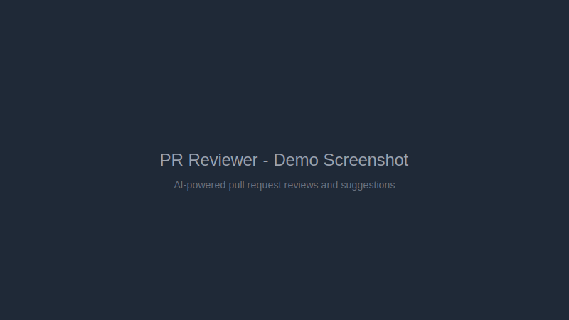
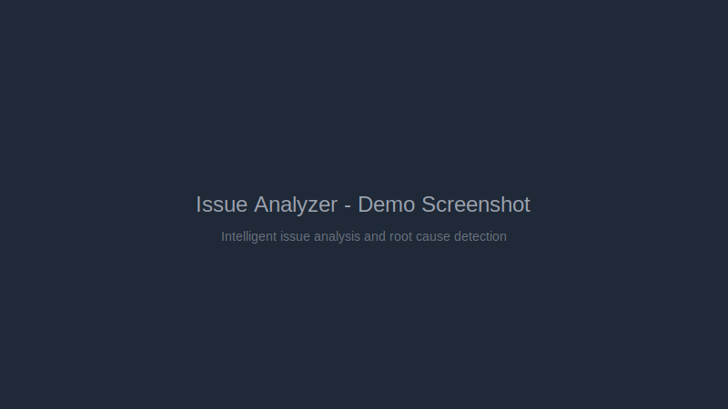
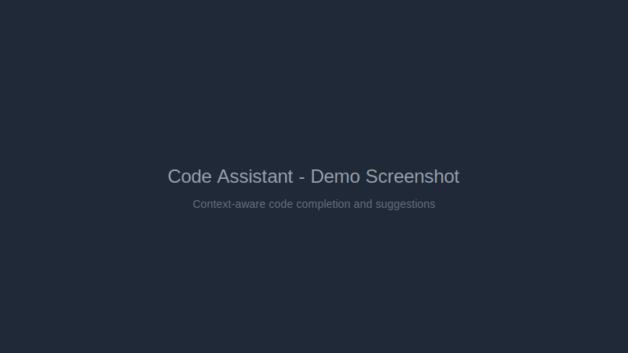
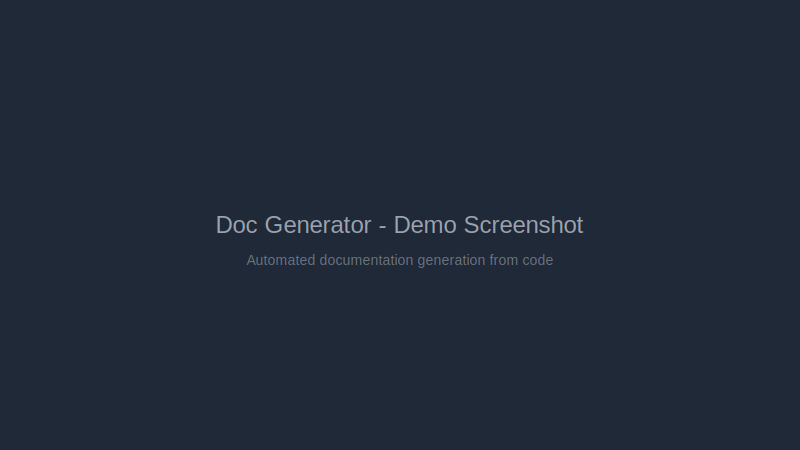
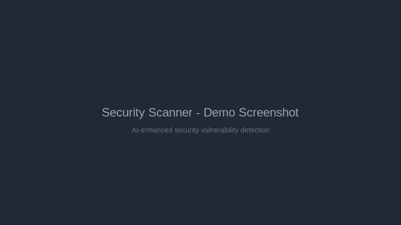
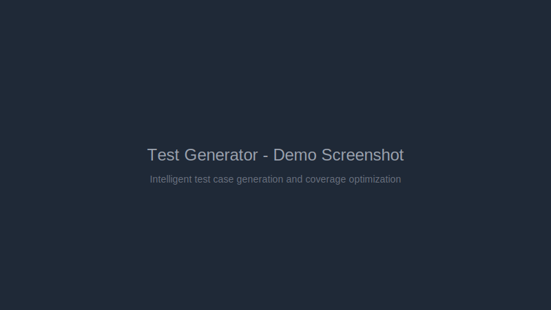

# GitHub AI Toolkit

[](https://opensource.org/licenses/MIT)
[](https://www.python.org/downloads/)
[](https://nextjs.org/)
[](https://fastapi.tiangolo.com/)

A comprehensive suite of **6 AI-powered tools** for GitHub workflow automation and enhancement. Supercharge your development workflow with intelligent PR reviews, automated documentation, security scanning, and more.

## Tools

| # | Tool | Description |
|---|------|-------------|
| 1 | [PR Reviewer](#pr-reviewer) | AI-powered pull request reviews with actionable suggestions |
| 2 | [Issue Analyzer](#issue-analyzer) | Intelligent issue analysis and root cause detection |
| 3 | [Code Assistant](#code-assistant) | Context-aware code completion and suggestions |
| 4 | [Doc Generator](#doc-generator) | Automated documentation generation from code |
| 5 | [Security Scanner](#security-scanner) | AI-enhanced security vulnerability detection |
| 6 | [Test Generator](#test-generator) | Intelligent test case generation and coverage optimization |

## Quick Start

```bash
# Clone the repository
git clone https://github.com/Aussielad89/-AI-Tool-Suite-Development.git
cd -AI-Tool-Suite-Development

# Start backend
cd backend
pip install -r requirements.txt
uvicorn app.main:app --reload

# Start frontend (in another terminal)
cd frontend
npm install
npm run dev
```

## Features

### PR Reviewer
- Automated PR analysis with severity scoring
- File-level comments with improvement suggestions
- Review history tracking
- Approval/rejection recommendations

### Issue Analyzer
- Intelligent issue categorization and prioritization
- Root cause analysis with suggested fixes
- Related issue detection
- Confidence scoring for AI predictions

### Code Assistant
- Context-aware code suggestions
- Multiple language support
- Alternative implementation suggestions
- Pattern recognition and best practices

### Doc Generator
- Automated README and documentation generation
- Code comment extraction and formatting
- Documentation coverage tracking
- Multiple output formats

### Security Scanner
- AI-enhanced vulnerability detection
- CWE classification
- Severity-based prioritization
- Remediation recommendations

### Test Generator
- Intelligent test case generation
- Multiple framework support (pytest, unittest, jest)
- Coverage optimization suggestions
- Edge case detection

## Architecture

```
github-ai-toolkit/
├── backend/                 # FastAPI unified backend
├── frontend/                # Next.js dashboard
├── shared/
│   ├── github-integration/  # GitHub API service
│   └── ui-components/       # Reusable React components
├── tools/
│   ├── pr-reviewer/
│   ├── issue-analyzer/
│   ├── code-assistant/
│   ├── doc-generator/
│   ├── security-scanner/
│   └── test-generator/
└── docs/                    # Documentation
```

## Tech Stack

- **Backend**: FastAPI + Python 3.12
- **Frontend**: Next.js 14 + React + TypeScript
- **AI**: OpenAI/Anthropic APIs
- **Integration**: GitHub API
- **Testing**: pytest

## Screenshots

### PR Reviewer


### Issue Analyzer


### Code Assistant


### Doc Generator


### Security Scanner


### Test Generator


## API Documentation

Once the backend is running, visit `http://localhost:8000/docs` for interactive API documentation.

## License

MIT - see [LICENSE](LICENSE) for details.

## Contributing

Contributions are welcome! Feel free to open issues or submit pull requests.

## Star History

If you find this project useful, please consider giving it a star!
